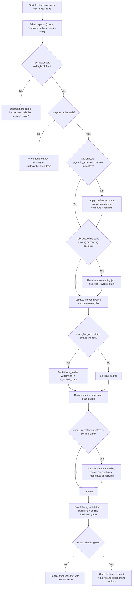

# Indicator Pipeline Recovery Runbook

## Purpose

Recover and harden the indicator pipeline when any of these go stale:

- `indicators.ohlcv_5m`, `indicators.ohlcv_15m`
- `indicators.indicator_values`
- `indicators.open_interest`, `indicators.oi_features`
- synthetic/serving signals that depend on those sources

This runbook is fail-closed and production-safe.

## Non-Negotiable Guardrail

Do **not** change the GCP VM websocket raw ingestion behavior (`public.raw_trades` + order book feed path) in this runbook.

If websocket ingestion needs edits, open a separate change request and approval path.

## Decision Tree



## Step 0: Snapshot And Freeze

Run and save a baseline before touching anything:

```bash
python3 /Users/vitolo/Desktop/projects/poly/scripts/ops/recovery_snapshot.py
python3 /Users/vitolo/Desktop/projects/poly/scripts/healthcheck_all.py --window-hours 24 --recent-minutes 5
```

Capture:

- `authenticator` `pgrst.db_schemas`
- `indicators.job_queue` counts by status
- latest timestamps for `raw_trades`, `ohlcv_*`, `indicator_values`, `open_interest`, `oi_features`, `order_book_indicators`

## Step 1: Confirm Incident Class

Compute-outage signature:

- `raw_trades` + `order_book_indicators` are fresh
- `ohlcv_5m` / `ohlcv_15m` / `indicator_values` stale
- backlog in `indicators.job_queue` (`pending` high, possibly stale `running`)

Query:

```sql
select source, pair, max_ts,
       extract(epoch from ((now() at time zone 'utc') - max_ts))::bigint as lag_seconds
from (
  select 'raw_trades' as source, pair, max(executed_at) as max_ts from public.raw_trades group by pair
  union all
  select 'order_book_indicators', pair, max(captured_at) from indicators.order_book_indicators group by pair
  union all
  select 'ohlcv_5m', pair, max(bucket_time) from indicators.ohlcv_5m group by pair
  union all
  select 'ohlcv_15m', pair, max(bucket_time) from indicators.ohlcv_15m group by pair
  union all
  select 'indicator_values', pair, max(bucket_time) from indicators.indicator_values group by pair
) x
where pair in ('BTC-USD','ETH-USD','SOL-USD')
order by source, pair;
```

## Step 2: Restore Worker Runtime Path

If `authenticator` is missing `indicators` in `pgrst.db_schemas`, apply:

- `supabase/migrations/20260224_160000_indicator_runtime_recovery_guards.sql`

This enforces:

1. PostgREST schema exposure includes `indicators`
2. stale-running reclaim function exists
3. reclaim cron job is scheduled

Validate:

```bash
python3 /Users/vitolo/Desktop/projects/poly/scripts/ops/check_postgrest_required_schemas.py
```

## Step 3: Reclaim Queue And Drain Backlog

Manual one-time reclaim:

```sql
select indicators.fn_reclaim_stale_indicator_jobs(interval '10 minutes');
```

Then verify queue evolution:

```sql
select status, count(*)::int as n
from indicators.job_queue
group by status
order by status;
```

Drain success criteria:

- `pending` trends down
- `running` does not stall for >10 minutes
- `failed` remains near zero and non-increasing

## Step 4: Repair Source Gaps Before Rollups

Do this only if 1m continuity is broken in outage window.

Check continuity:

```sql
with bounds as (
  select date_trunc('minute', now() at time zone 'utc' - interval '24 hours') as start_ts,
         date_trunc('minute', now() at time zone 'utc') - interval '1 minute' as end_ts
),
expected as (
  select p as pair, gs as bucket_time
  from unnest(array['BTC-USD','ETH-USD','SOL-USD']) p
  cross join bounds b
  cross join generate_series(b.start_ts, b.end_ts, interval '1 minute') gs
),
actual as (
  select pair, bucket_time
  from indicators.ohlcv_1m
  where pair in ('BTC-USD','ETH-USD','SOL-USD')
    and bucket_time between (select start_ts from bounds) and (select end_ts from bounds)
)
select e.pair, count(*)::int as missing_minutes
from expected e
left join actual a on a.pair = e.pair and a.bucket_time = e.bucket_time
where a.bucket_time is null
group by e.pair
order by e.pair;
```

If missing > 0:

1. backfill `public.raw_trades` for exact missing windows with:
   - `/Users/vitolo/Desktop/projects/poly/scripts/backfill_raw_trades_from_coinbase.py`
2. rebuild OHLCV:

```sql
select * from indicators.fn_backfill_ohlcv(interval '7 days');
```

## Step 5: Recompute Indicators

After OHLCV is repaired, let queue/worker catch up. If needed, run bounded recompute for gap window.

Validation targets:

- `indicator_values` latest bucket close to current time
- queue drained (`pending` near steady-state)
- no sustained `not_ready` caused by missing/stale inputs

## Step 6: OI Recovery Path

`oi_features_recent_2h` can be green while `open_interest` source is stale. Check both:

```sql
select pair, max(bucket_time) as latest_open_interest
from indicators.open_interest
where pair in ('BTC-USD','ETH-USD','SOL-USD')
group by pair
order by pair;

select pair, max(bucket_time) as latest_oi_features
from indicators.oi_features
where pair in ('BTC-USD','ETH-USD','SOL-USD')
group by pair
order by pair;
```

If `open_interest` is stale:

1. recover/restart the OI source writer process (external service)
2. backfill missing open-interest window
3. rerun:

```sql
select indicators.fn_compute_oi_features_recent('48 hours');
```

4. verify `open_interest` and `oi_features` freshness is within SLO

## Step 7: Enable Permanent Guardrails

Apply:

- `supabase/migrations/20260224_161000_indicator_worker_backstop_cron.sql`
- `supabase/migrations/20260224_162000_add_pipeline_health_watchdog.sql`

This adds:

1. minute-level worker backstop trigger
2. pipeline watchdog cron
3. hard fail on freshness/continuity violations
4. persistent audit log in `indicators.pipeline_health_audit`

## Step 8: Verify End State (Go/No-Go)

Run:

```bash
python3 /Users/vitolo/Desktop/projects/poly/scripts/healthcheck_all.py --window-hours 24 --recent-minutes 5
```

Must be true:

1. no stale freshness checks for `ohlcv_1m/5m/15m`, `indicator_values`, `open_interest`, `oi_features`, `order_book`
2. `ohlcv_1m` missing-minute check meets policy
3. `job_queue` backlog is stable and draining
4. `postgrest_schema_config` is PASS (`public` + `indicators` present)

## Step 9: Post-Incident Record

Write UTC timeline and evidence:

- first stale timestamp
- detection time
- recovery actions
- restored time
- preventive controls merged

Reference file for operating policy:

- `docs/runbooks/gitops-operating-model.md`
